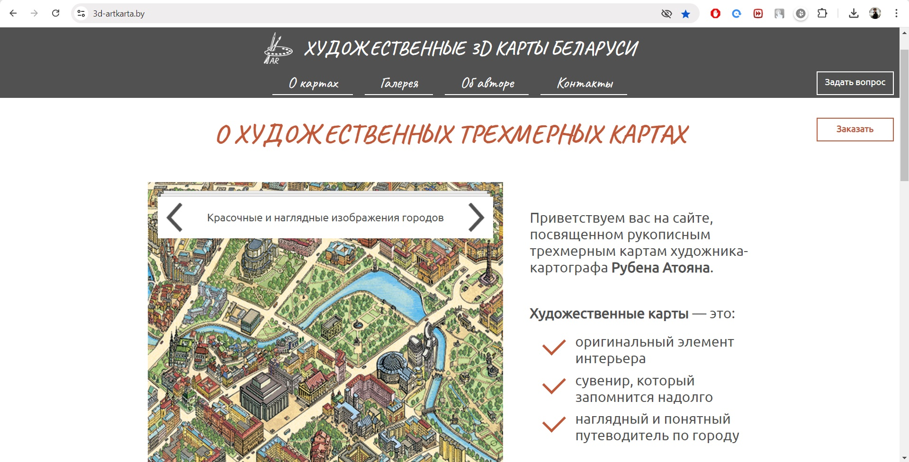
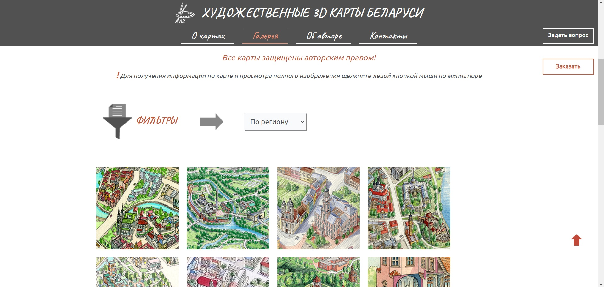

# Художественные 3D-карты Беларуси (HTML | CSS | JS | Wordpress)

[Переключиться на английский | Switch to English](./readme.md)

## О проекте
Персональный сайт художника-картографа Р. Атояна, где представлены его графические работы, творческий путь.

**Инструменты:** 

**Языки:** 
 
 
 

**Демо:** [Перейти на сайт](https://3d-artkarta.by/)  

## Реализованный функционал:
1. спроектирована информационная структура, разработаны прототипы страниц и дизайн (Figma);
2. написан HTML и CSS код на базе CMS WordPress, реализована адаптивность верстки;
3. разработан слайдер на главной странице сайта, слайдеры в разделе "Галерея" (JS);
4. добавлены вкладки с продукцией (HTML, CSS);
5. стилизованы отзывы на главной странице (HTML, CSS);  
6. разработаны форма обратной связи и оформления заказа (JS);
7. добавлена фильтрация карт в галерее, отображение полноразмерного рисунка и основной информации о карте при клике на миниатюру (JS).