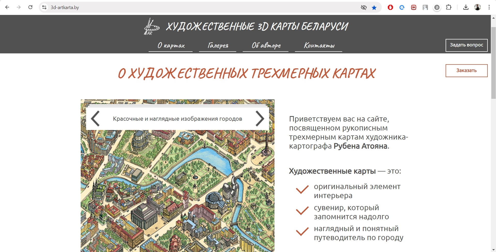

#  3D artistic maps of Belarus (HTML | CSS | JS | Wordpress)

[Switch to Russian | Переключиться на русский](./readme-ru.md)

## About the project
Personal site of the artist-cartographer R. Atoyan, where his graphic works, creative path are presented.

**Tools:** 

**Stack:** 
 
 
 

**Demo:** [Link to site](https://3d-artkarta.by/)  

## Realized functionality:
1. the information structure was designed, prototypes of pages and design were developed (Figma);
2. HTML and CSS code based on CMS WordPress was developed, adaptability of layout was realized;
3. slider on the main page of the site, as well as sliders in the “Gallery” section were developed (JS);
4. tabs with products were added (HTML, CSS);
5. reviews on the main page were stylized (HTML, CSS);  
6. feedback form and order placement were developed (JS);
7. map filtering in the gallery, which display full-size image and basic information about the map when clicking on the thumbnail was added (JS).